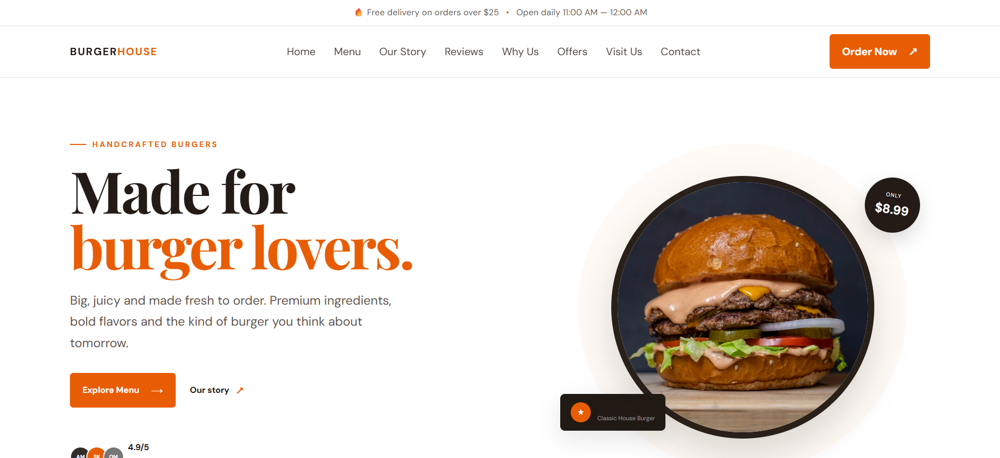

# 🍔 Burger House Landing Page

A modern and responsive landing page for a burger restaurant, built using HTML, CSS, and JavaScript.

## 🌐 Live Demo

[[View Live Website](YOUR_GITHUB_PAGES_LINK)](https://ahmedmaher-cse.github.io/burger-house-landing-page/)

## 📸 Preview

## ✨ Features

- Responsive design for desktop, tablet, and mobile
- Modern and clean restaurant interface
- Hero section with call-to-action
- Menu section
- Our Story section
- Customer Reviews section
- Why Us section
- Special Offers section
- Visit Us section
- Contact section
- Responsive navigation menu
- Smooth scrolling between sections
- Interactive JavaScript elements

## 🛠️ Technologies

- HTML5
- CSS3
- JavaScript
- Responsive Web Design

## 📂 Project Structure

├── index.html
├── style.css
├── script.js
├── preview.png
└── README.md

## 🎯 Project Purpose

This project was created to practice and demonstrate front-end web development skills by building a complete responsive landing page for a restaurant.

## 👨‍💻 Developer

**Ahmed Maher**

Computer Engineering Student & Aspiring Full-Stack .NET Developer

## 🔗 Portfolio

[Ahmed Maher Portfolio](https://ahmedmaher-cse.github.io/ahmed-portfolio/)
